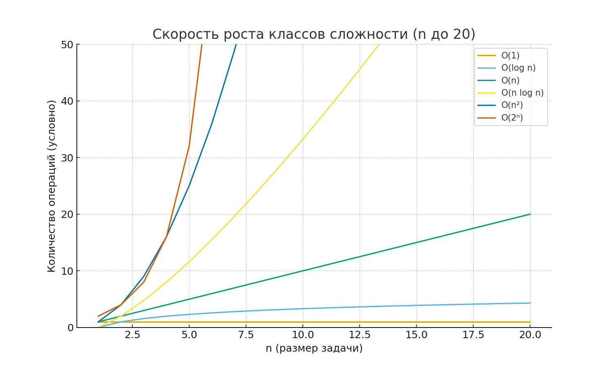
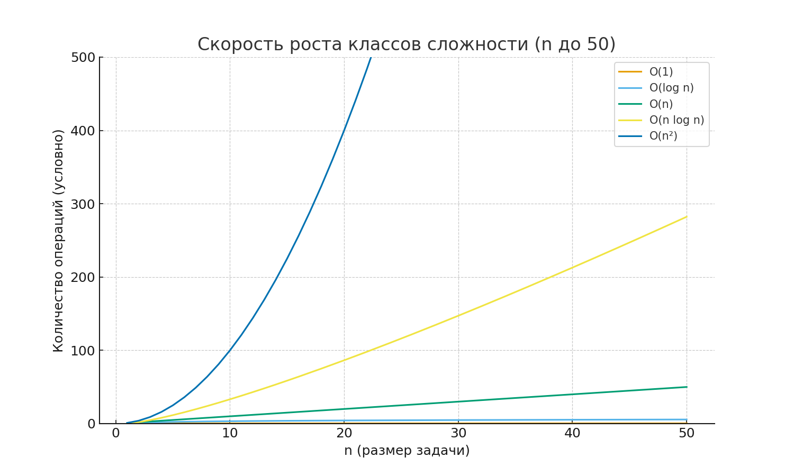
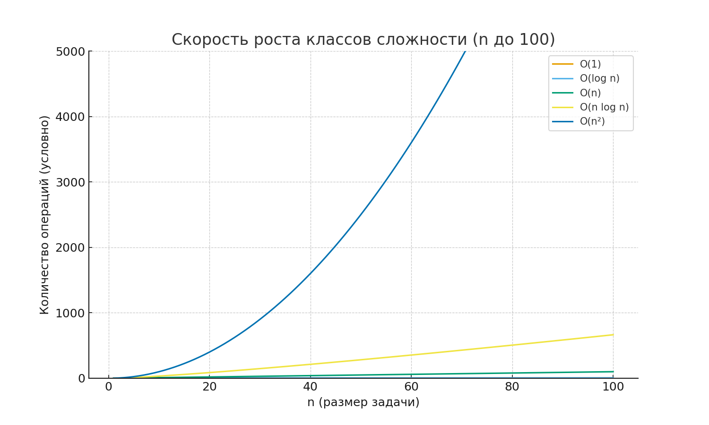
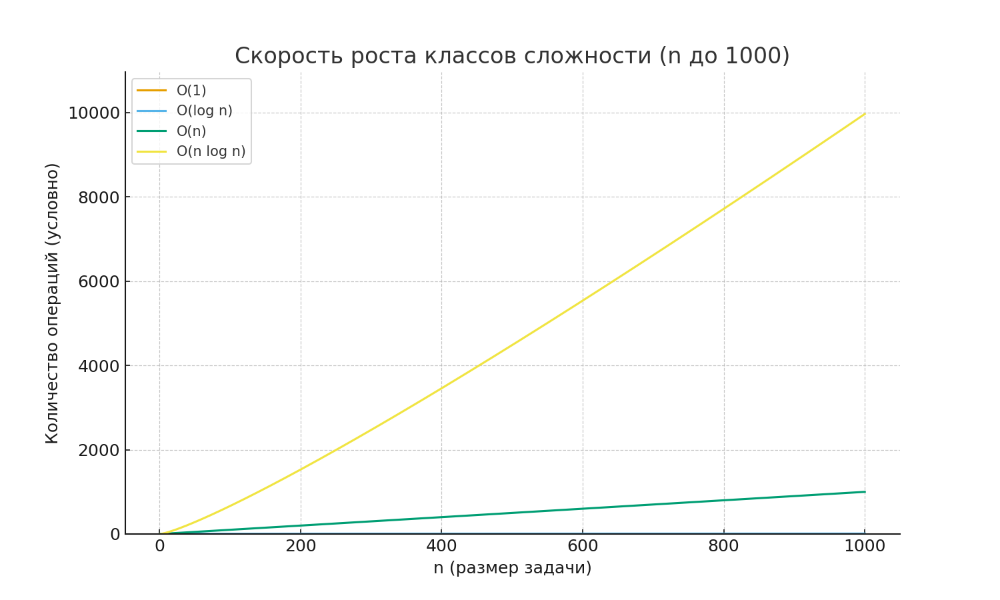
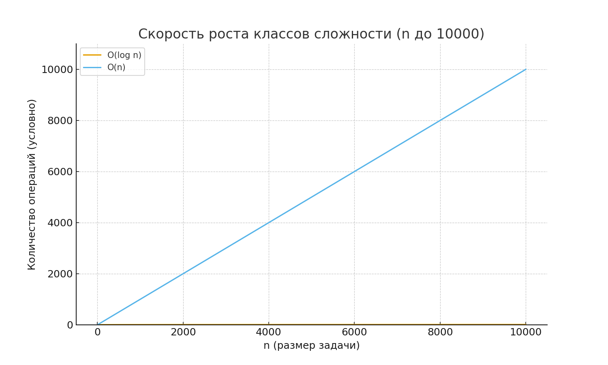
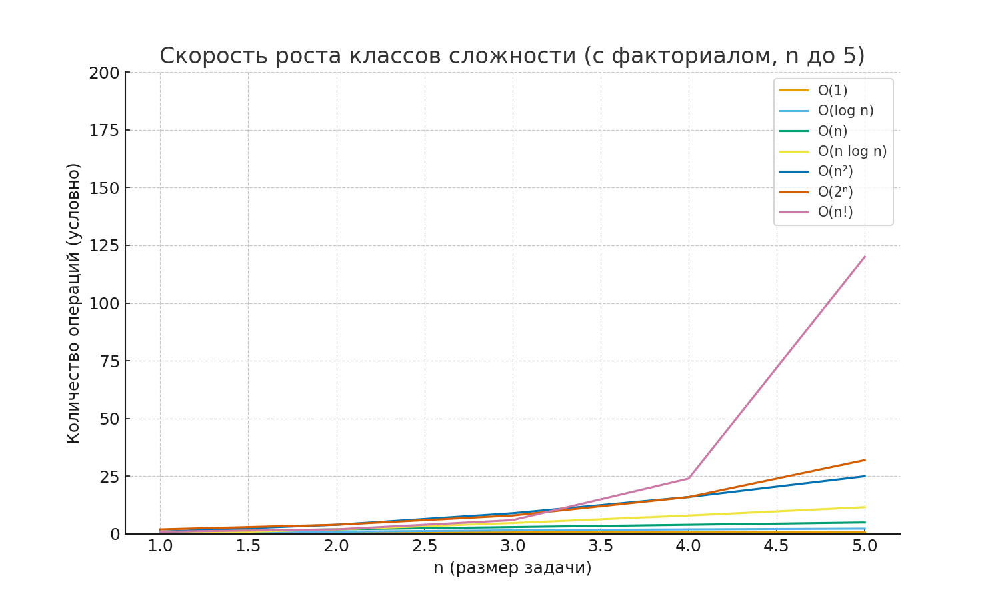
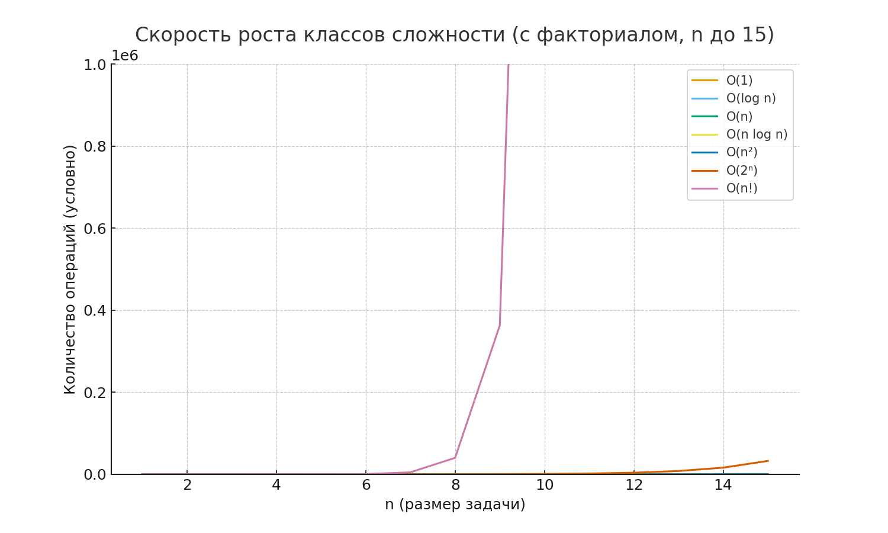
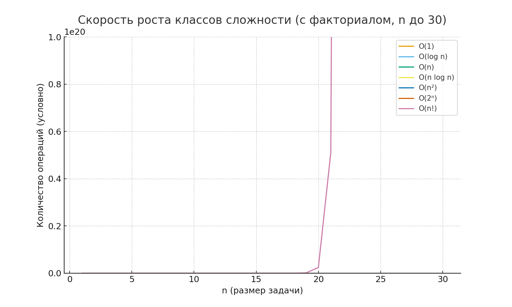

# Асимптотический анализ алгоритмов

## Введение — зачем вообще считать «быстроту» алгоритмов
Представьте популярный сервис доставки еды в час пик. Заказы сыплются один за другим, и от скорости обработки зависит, получит ли клиент горячую пиццу или остынувшую. Алгоритмы в программировании работают так же: два решения могут давать один результат, но одно управится мгновенно, а другое заставит людей ждать. Асимптотический анализ помогает заранее понять, насколько быстро идея справится с потоком данных, когда их станет не десятки, а миллионы.

Чтобы сравнивать алгоритмы, нужен язык, независимый от модели смартфона или капризов операционной системы. Мы хотим оценить сами принципы: что будет, если вместо списка из 30 заказов обработать 300 000? Эту картину роста и рисует асимптотический анализ.

## 1. Почему это важно — практика
- **Проектирование:** знание сложностей помогает выбрать правильные структуры данных и алгоритмы до того, как начнутся тормоза.
- **Масштабирование:** сегодня у сервиса 100 пользователей, завтра — миллион. Плохие алгоритмы могут «съесть» всё время сервера.
- **Экономия ресурсов:** быстрые программы тратят меньше энергии и денег на обслуживание.
- **Профессиональный диалог:** программисты объясняют свои решения именно языком сложностей. Это общий словарь команды.

## 2. Идея асимптотического анализа: не секундомер, а математика роста
Измерять время по секундомеру удобно, но результат сильно зависит от конкретного железа, фоновых процессов и даже настроек программы. Асимптотический анализ задаёт другой вопрос: «Как изменится время работы алгоритма, если входные данные вырастут в 10, 100 или 1000 раз?»

Это похоже на прогноз урожая. Нас не интересует, сколько зёрен соберём с одного колоса, — важно, как поведёт себя поле, если расширить посевы. Мы смотрим на темп роста, а не на отдельные секунды. Поэтому асимптотический анализ — это не про секундомер, а про математику поведения алгоритма при масштабировании.


## 3. Основные обозначения: O, Ω, Θ — объяснение на простых аналогиях
### Большое O: верхняя планка
`O(f(n))` — это потолок. Представьте, что вы поднимаете коробки на склад: выше потолочной балки их всё равно не забросить. Так и алгоритм: если сложность `O(n²)`, значит, в худшем случае время не растёт быстрее, чем квадрат размера входа.

### Омега: надёжный пол
`Ω(f(n))` — пол, ниже которого не провалишься. Даже если всё сложится удачно, алгоритм не сможет работать быстрее, чем диктует эта функция.

### Тета: коридор роста
`Θ(f(n))` — коридор между полом и потолком. Когда алгоритм ограничен и сверху, и снизу одной функцией, мы знаем, как он растёт и в лучшем, и в худшем сценариях. Это удобный «портрет» поведения.


## 3.1 Константа
<details>
<summary>Почему константа не учитывается в асимптотике</summary>

1. **Определение Big-O.**  
   В $O(f(n))$ всегда предполагается, что существуют константы $c > 0$ и $n_0$, такие что  
   $$
   T(n) \leq c \cdot f(n), \quad \forall n > n_0
   $$
   Константа $c$ заранее допускает масштабирование функции на фиксированный множитель.

2. **Случай $O(C + n)$.**  
   Если $T(n) = C + n$, то при больших $n$ вклад $C$ становится ничтожным относительно $n$, потому что  
   $$
   \lim_{n \to \infty} \frac{C+n}{n} = 1
   $$
   Значит, асимптотически $T(n)$ ведёт себя как $n$, и мы записываем $O(n)$.

3. **Случай $O(C \cdot n)$.**  
   Когда $T(n) = C \cdot n$, множитель $C$ просто растягивает график, но не меняет порядок роста:  
   $$
   \lim_{n \to \infty} \frac{Cn}{n} = C
   $$
   то есть остаётся конечной константой. Поэтому сложность по-прежнему $O(n)$.

4. **Практический вывод.**  
   Асимптотика отвечает за скорость роста при $n \to \infty$, а не за точные значения при фиксированном $n$. Она помогает различать классы ($O(n)$, $O(n^2)$, $O(2^n)$ и т. п.), игнорируя мелкие отличия масштаба.

</details>

## 4. Примеры классов сложности с жизненными сравнениями
- `O(1)` — многосекционный органайзер: открываете нужную ячейку и сразу находите вещь. Пример: доступ к элементу массива по индексу.
- `O(log n)` — игра «Угадай число» с делением пополам. Каждый вопрос сужает диапазон, и ответ находится стремительно. Пример: бинарный поиск в отсортированном списке.
- `O(n)` — проверка чека из супермаркета. Чтобы убедиться, что всё верно, нужно просмотреть каждую позицию. Пример: линейный поиск по массиву.
- `O(n log n)` — сортировка стопки визиток: разбили пачку на меньшие, навели порядок и собрали обратно. Пример: сортировка слиянием или быстрая сортировка.
- `O(n²)` — составление расписания встреч, когда нужно проверить каждую возможную пару людей. Количество сравнений растёт как квадрат количества участников. Пример: двойные вложенные циклы.
- `O(2^n)` — подбор экипировки для похода, когда перебираете все комбинации вещей «взять/не брать». Вариантов становится вдвое больше с каждым новым предметом. Пример: полный поиск всех подмножеств.
- `O(n!)` — рассадка гостей за праздничным столом всеми возможными способами. Даже небольшая компания превращается в лавину вариантов. Пример: перебор всех перестановок.





### Сравнение линейного и логарифмического роста



<!-- <details> -->
<!-- <summary>Визуализация роста факториала</summary> -->




<!-- </details> -->

## Асимптотическая пространственная сложность
Асимптотический анализ применяется и к памяти: важно понимать, как быстро растёт объём необходимых ресурсов при увеличении входных данных.

**Space complexity** описывает порядок роста дополнительной памяти, которую алгоритм использует при увеличении размера данных.

Для оценки памяти применяются те же обозначения `O`, `Θ`, `Ω`, только теперь они относятся к количеству хранимой информации.

- Поиск элемента в массиве использует `O(1)` дополнительной памяти.

```go
func contains(nums []int, target int) bool {
    for _, value := range nums {
        if value == target {
            return true
        }
    }
    return false
}
```

- Создание массива префиксных сумм требует `O(n)` памяти, потому что хранит отдельный результат для каждого индекса.

[0, 1, 4, 5, 8]
[0, 1, 5, 10, 18]

0. acc = 0; [0]
1. acc = 0 + 1 = 1; [0, 1]
2. acc = 1 + 4 = 5; [0, 1, 5]
3. acc = 5 + 5 = 10; [0, 1, 5, 10]
4. acc = 10 + 8 = 18; [0, 1, 5, 10, 18]

```go
func prefixSums(data []int) []int {
    sums := make([]int, len(data))
    acc := 0
    for i, value := range data {
        acc += value
        sums[i] = acc
    }
    return sums
}
```

- Рекурсивный подсчёт использует стек вызовов глубиной `n`, поэтому занимает `O(n)` памяти.

```go
func sumRecursive(nums []int, index int) int {
    if index == len(nums) {
        return 0
    }
    return nums[index] + sumRecursive(nums, index+1)
}
```


## 5. Иллюстрация на простых программах
Ниже — короткие примеры на Go. Они показывают, как структура кода влияет на сложность.

### `O(1)` — мгновенный доступ
```go
func firstReading(readings []int) int {
    return readings[0] // одно действие, независимо от длины списка
}
```

### `O(n)` — линейный проход
```go
func averageValue(values []int) float64 {
    total := 0
    for _, v := range values {
        total += v // повторяем шаг для каждого элемента
    }
    avg := float64(total) / float64(len(values))
    amount := 0
    for _, v := range values {
        if v >= avg {
            amount++
        }        
    }
    return float64(total) / float64(len(values))
}
```

[0, 1, 2, 3]

O(n^2); n = 4; 16

O(n^2 * 1/2)

0:
- 0
- 1
- 2
- 3
  
1:
- 1
- 2
- 3

2:
- 2
- 3

3:
- 3

### `O(n²)` — сравнение всех пар
```go
func hasDuplicateIDs(ids []string) bool {
    for i := 0; i < len(ids); i++ {
        for j := i; j < len(ids); j++ {
            if ids[i] == ids[j] {
                return true // нашли совпадение
            }
        }
    }
    return false
}
```
Вложенный цикл запускается заново для каждого элемента, поэтому стоимость растёт как квадрат длины списка.


## 6. Таблица: что успеет сделать компьютер примерно за секунду
Предположим, что компьютер выполняет около 1 000 000 000 простых операций в секунду.

| Сложность | Примерное максимальное `n` | Жизненный образ |
| --- | --- | --- |
| `O(1)` | любое | щёлкнуть выключателем света |
| `O(log n)` | ~10^18 | угадывать число, каждый раз деля диапазон пополам |
| `O(n)` | ~1 000 000 000 | просмотреть гигантский чек из гипермаркета |
| `O(n log n)` | ~50 000 000 | аккуратно отсортировать базу контактов |
| `O(n²)` | ~30 000 | проверить все пары участников конференции |
| `O(n³)` | ~1 000 | перебрать все тройки товаров в каталоге |
| `O(2^n)` | ~30 | подобрать набор гаджетов, перебирая все комбинации |
| `O(n!)` | ~12 | переставить гостей за столом во всех порядках |

Даже грубая оценка показывает, что экспоненциальные алгоритмы очень быстро выходят за пределы возможностей, тогда как линейные и логарифмические спокойно переваривают огромные объёмы данных.

## 7. Краткое резюме с ключевыми словами
- Асимптотический анализ показывает, как алгоритм реагирует на рост входных данных.
- Нотации `O`, `Ω`, `Θ` задают верхние, нижние и точные оценки.
- Классы сложности — удобные ярлыки для быстрой оценки эффективности.
- Чем медленнее растёт функция, тем лучше алгоритм масштабируется.

**Ключевые слова:** алгоритм, сложность, big-O, верхняя оценка, нижняя оценка, бинарный поиск, сортировка, экспоненциальный рост.

## 8. Вопросы для обсуждения
- Придумайте пару-тройку реальных примеры вы встречали, где выбор неправильного алгоритма приводил к проблемам масштабирования?
- В каких случаях стоит предпочесть приблизительный алгоритм с лучшей сложностью точному, но медленному?
- Почему важно анализировать не только время, но и асимптотику потребления памяти?

## 9. Задачи на определение асимптотики
### Задача 1
```go
func countPairs(nums []int) int {
    total := 0
    for i := 0; i < len(nums); i++ {
        for j := i + 1; j < len(nums); j++ {
            if nums[i]+nums[j] > 0 {
                total++
            }
        }
    }
    return total
}
```

### Задача 2
```go
func hasValue(matrix [][]int, target int) bool {
    for _, row := range matrix {
        for _, value := range row {
            if value == target {
                return true
            }
        }
    }
    return false
}
```
Какую асимптотику имеет поиск по двумерному массиву при размерах `m x n`?

### Задача 3
```go
func prefixSums(data []int) []int {
    sums := make([]int, len(data))
    acc := 0
    for i, value := range data {
        acc += value
        sums[i] = acc
    }
    return sums
}
```

### Задача 4
```go
func uniqueSorted(values []int) []int {
    sort.Ints(values)
    result := []int{values[0]}
    for i := 1; i < len(values); i++ {
        if values[i] != values[i-1] {
            result = append(result, values[i])
        }
    }
    return result
}
```
Найдите асимптотику по времени и памяти, учитывая, что `sort.Ints` использует сортировку `O(n log n)`.
