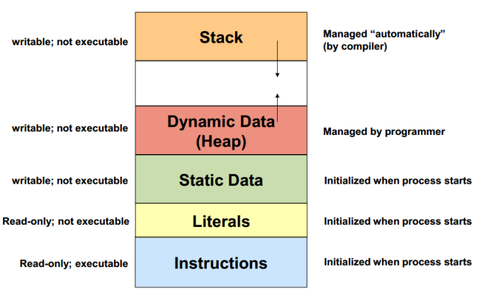

## Часть 0 · Биты и байты (основы)

**Основные факты**

* **Бит** (bit) - это 0 или 1.  
* **Байт** (byte) - это 8 бит и является **наименьшей адресуемой единицей** в современных процессорах (x86/x86-64, ARM/ARM64). Каждый адрес памяти указывает на один **байт**.  
* **Слово** (word) - это естественный размер регистра процессора (часто 32 или 64 бита). Это **не** наименьшая адресуемая единица.  
* Адреса считают байты; **типы данных** определяют, сколько байт нужно прочитать/записать, начиная с этого адреса.  

---

### Единицы измерения

* 1 **байт** = 8 бит  
* 1 **КиБ** = 1024 байта  
* 1 **МиБ** = 1024 КиБ  
* Для точности используйте КиБ/МиБ/ГиБ; КБ/МБ/ГБ часто используются менее строго.  

---

### Типы данных

| Тип | Типичный размер | Основная идея |
|---|---:|---|
| **Логический** | 1 бит (хранится в ≥1 байте) | Два значения: истина/ложь. |
| **Байт** | 8 бит | Наименьшая адресуемая единица. |
| **Целое (знаковое n-битное)** | 8/16/32/64 | Диапазон ≈ −2^(n−1)…2^(n−1)−1. |
| **Целое (беззнаковое n-битное)** | 8/16/32/64 | Диапазон 0…2^n−1. |
| **Целое машинного размера** | 32 или 64 бита | Соответствует размеру слова платформы. |
| **Float32 / Float64** | 32 / 64 бита | IEEE-754; приближённые вещественные числа. |
| **Текст (UTF-8 строка)** | переменный | Unicode в 1–4 байтах на кодпоинт. |
| **Указатель / Ссылка** | 32 или 64 бита | Адрес/хэндл к данным или объекту. |
| **Массив (фиксированный)** | N × размер элемента | Непрерывный, фиксированной длины. |
| **Динамический массив / Срез** | дескриптор + данные | Изменяемый размер; базовое хранилище может перемещаться. |
| **Структура / Запись** | сумма полей (+выравнивание) | Группа полей; выравнивание для оптимизации. |

---

## Визуальная схема (концептуальное адресное пространство)
Представим, что у нас всего 16КБ памяти:





> Это **концептуальная** схема; фактические адреса меняются при каждом запуске из-за ASLR (рандомизации адресного пространства). Относительные роли областей остаются неизменными.

---

## Определения в одном предложении

* **Стек** (Stack) — автоматическое хранилище для каждого вызова функции (локальные переменные, адреса возврата); очень быстрое; ограниченное; освобождается при возврате из функции.  
* **Куча** (Heap) — динамическая память, запрашиваемая через `malloc` и освобождаемая через `free`; гибкий размер; медленнее; вы управляете временем жизни.  
* **Статические/Глобальные** (Static/Globals) — переменные, существующие всё время работы программы (глобальные в области файла или `static` переменные внутри функций).  
* **Отображённые области** (Mapped regions) — области памяти, которые ОС отображает в ваш процесс (общие библиотеки, файлы, отображённые в память, и иногда крупные выделения памяти).  

---

## Пример на C

```c
// globals.c (для иллюстрации)
#include <stdlib.h>

int g = 1;          // глобальная → статическая память (всё время работы)
static int sg = 2;  // static в области файла → статическая память

int main(void) {
    static int sl = 3;      // static в функции → статическая память
    int local = 4;          // стек (существует до возврата из функции)

    int *p = malloc(sizeof *p); // куча (существует до вызова free)
    *p = 5;

    const char *s = "hi";  // указатель в стеке; строка в отображённой, read-only области

    free(p);
    return 0;
}
```

---

## Практические рекомендации

* Предпочитайте **стек** для небольших, кратковременных данных. Это автоматично и быстро.  
* Используйте **кучу** для больших данных или данных переменного размера, которые должны пережить текущую функцию. Всегда освобождайте (`free`) то, что выделили (`malloc`).  
* Используйте **статические/глобальные** для действительно общего, долгоживущего состояния или констант. Не злоупотребляйте ими.  
* **Отображённые области** в основном управляются ОС/средой выполнения (общие библиотеки). При явном вызове `mmap` для файла, работайте с ним как с массивом в памяти.  

---

## Резюме

Этот обзор охватывает фундаментальные концепции организации памяти, включая:
- Базовые единицы хранения (биты, байты, слова)
- Адресация памяти и выравнивание
- Знаковые/беззнаковые представления
- Четыре основные области памяти (стек, куча, статические/глобальные, отображённые области)
- Практические рекомендации по использованию памяти