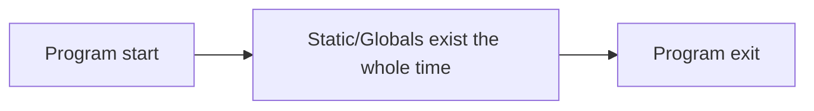

# Static — Short Dive (C)

**What it means**

* **Static storage duration**: the object exists for the **entire program run**.
* **File‑scope `static`**: symbol is **hidden** from other translation units (internal linkage).
* **Function‑scope `static`**: a single instance shared across calls to that function.
* Objects with static storage are **zero‑initialized** by default and must be initialized with a **compile‑time constant**.

---

## Visual: lifetime at a glance



---

## Example 1 — Function‑local static keeps its value

```c
// static_counter.c
#include <stdio.h>

void hit(void) {
    static int count = 0; // initialized once, persists across calls
    ++count;
    printf("hit count = %d
", count);
}

int main(void) {
    hit(); hit(); hit(); // prints 1, then 2, then 3
}
```

**Build & run**

```bash
gcc -O0 -g -Wall -Wextra static_counter.c -o static_counter
./static_counter
```

---

## Example 2 — File‑scope `static` hides a symbol

```c
// hidden.c
static int hidden = 42;         // internal linkage: not visible outside this file
int public_value(void) { return hidden; }
```

```c
// main.c
#include <stdio.h>
int public_value(void);
int main(void) { printf("%d
", public_value()); }
```

**Build (two files)**

```bash
gcc -O0 -g -Wall -Wextra hidden.c main.c -o demo_hidden
./demo_hidden   # prints 42
```

> If another file tries `extern int hidden;` the linker will complain: the symbol isn’t exported.

---

## Example 3 — Static data for lookup tables

```c
// static_table.c
#include <stdio.h>

static const char *keywords[] = { "if", "else", "for", "while", NULL };

int main(void) {
    for (int i = 0; keywords[i]; ++i) puts(keywords[i]);
}
```

* Marking as `const` makes the table read‑only by type; `static` makes it file‑private and gives it program‑long lifetime.

---

## Example 4 — Returning a pointer to a static (legal but risky)

```c
// static_buf.c
#include <stdio.h>

char *buf(void) {
    static char b[32];     // lives for the entire program
    return b;              // legal to return this address
}

int main(void) {
    char *p = buf();
    for (int i = 0; i < 5; ++i) p[i] = 'A' + i;
    p[5] = '�';
    puts(p);               // prints ABCDE
}
```

> **Caution**: shared global state harms reentrancy; multiple callers may trample each other. Prefer caller‑provided buffers or dynamic allocation when concurrency/reuse matters.

---

## Rules & restrictions (C)

* Initialization must be a **constant expression** (e.g., numbers, addresses of globals, string literals). This is **invalid** and won’t compile:

  ```c
  static int x = getpid(); // ❌ not a constant expression
  ```
* Function‑local `static` variables are initialized **once**, the first time control passes through their declaration.
* Not automatically thread‑safe if mutated: guard with a mutex or avoid shared mutable statics.
* `static` ≠ `const`. `static` is about **lifetime**/linkage; `const` is about **mutability** through a name.

---

## When to use

* Small, read‑only tables or configuration known at compile time.
* Private module‑level state that truly needs to live for the whole run.
* Avoid for request‑specific or per‑call data; pass state explicitly or use the heap.
