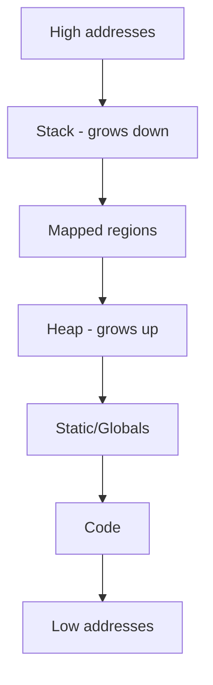

# Heap — Practical Basics (with light C examples)

**Purpose**: understand what the heap is, when to use it, and the few rules that keep you out of trouble. C is used only as a microscope—concepts apply to any language with dynamic memory.

---

## What the heap is (and isn’t)

* **Heap**: process‑wide pool for **dynamic** memory. You request bytes at runtime and release them when done.
* **Why use it**: variable size data, data that must outlive a function, or shared across functions/threads.
* **Not the stack**: the stack is per‑call and short‑lived; variables disappear on return.
* **Not statics/globals**: those live for the entire program and are created at startup.

---

## Visual: where it sits



---

## Few core rules (memorize these)

1. **You own what you allocate**: exactly one clear owner, exactly one `free`.
2. **Don’t touch after free**: set pointers to `NULL` after freeing.
3. **Stay in bounds**: allocate enough space (strings need `+1` for the `�`).
4. **Pointers can move**: `realloc` may return a **different** address—use the return value.

---

## Demo 1 — Heap address is stable across calls; stack isn’t

```c
// heap_stability.c
#include <stdio.h>
#include <stdlib.h>

static int *g; // points to heap memory

static void show(const char *who) {
    int stack_local = 0; // on this frame
    printf("%s: &stack_local=%p  g=%p -> %d
", who, (void*)&stack_local, (void*)g, *g);
}

static void f1(void) { show("f1"); }
static void f2(void) { show("f2"); }

int main(void) {
    g = malloc(sizeof *g); *g = 1234;
    show("main"); f1(); f2();
    free(g); g = NULL;
}
```

* Stack address changes per function; the heap pointer stays the same while it exists.

---

## Demo 2 — Strings and arrays on the heap (simple and safe)

```c
// heap_data.c
#include <stdio.h>
#include <stdlib.h>
#include <string.h>

int main(void) {
    // String on the heap
    const char *src = "dynamic";
    size_t n = strlen(src) + 1;     // +1 for terminator
    char *s = malloc(n);
    memcpy(s, src, n);

    // Array on the heap
    size_t len = 5;
    int *a = malloc(len * sizeof *a);
    for (size_t i = 0; i < len; ++i) a[i] = (int)(10*i);

    printf("s='%s' at %p
", s, (void*)s);
    printf("a at %p: ", (void*)a);
    for (size_t i = 0; i < len; ++i) printf("%d ", a[i]); puts("");

    free(a); free(s);
}
```

* Litteral strings are read‑only; heap strings are modifiable and must be freed.

---

## Demo 3 — What goes wrong (build with sanitizers)

```c
// heap_mistakes.c
#include <stdio.h>
#include <stdlib.h>
#include <string.h>

int main(void) {
    char *p = malloc(8);
    strcpy(p, "this is too long"); // ❌ overflow (writes past 8)

    int *q = malloc(sizeof *q);
    free(q);
    // printf("%d
", *q);        // ❌ use-after-free (commented out to run safely)

    // free(q);                    // ❌ double free (don’t do this)

    free(p);
}
```

**Compile with checks** (Clang/GCC):

```bash
gcc -O0 -g -fsanitize=address,undefined -fno-omit-frame-pointer heap_mistakes.c -o heap_mistakes
./heap_mistakes
```

The sanitizer pinpoints the bad line (overflow / UAF / double‑free) so you can fix it.

---

## Demo 4 — `realloc` may move the block

```c
// heap_realloc.c
#include <stdio.h>
#include <stdlib.h>
#include <string.h>

int main(void) {
    char *p = malloc(8);
    strcpy(p, "hi");
    printf("p=%p '%s'
", (void*)p, p);

    char *tmp = realloc(p, 4096); // may move
    if (!tmp) { free(p); return 1; }
    p = tmp;

    printf("p(now)=%p '%s'
", (void*)p, p);
    free(p);
}
```

**Pattern**: `tmp = realloc(p, new_size); if (tmp) p = tmp; else { /* p unchanged */ }`.

---

## Ownership patterns (language‑neutral idea)

* **Factory returns ownership**: a function creates an object and the caller frees it.
* **Caller‑owned buffer**: caller provides memory; callee fills it (no allocation).
* **Out‑parameter**: callee allocates and writes the pointer back (caller frees it).

Minimal out‑param sketch in C:

```c
int make_array(int **out, size_t n) {
    *out = malloc(n * sizeof **out);
    return *out ? 0 : -1;
}
```

---

## Quick checklist

* Do I truly need dynamic lifetime/size? If not, prefer stack.
* Did I allocate enough bytes (including terminators/padding)?
* Who owns this pointer, and where is the one `free`?
* After `realloc`, did I switch to the returned pointer?
* After `free`, did I null out all aliases?
