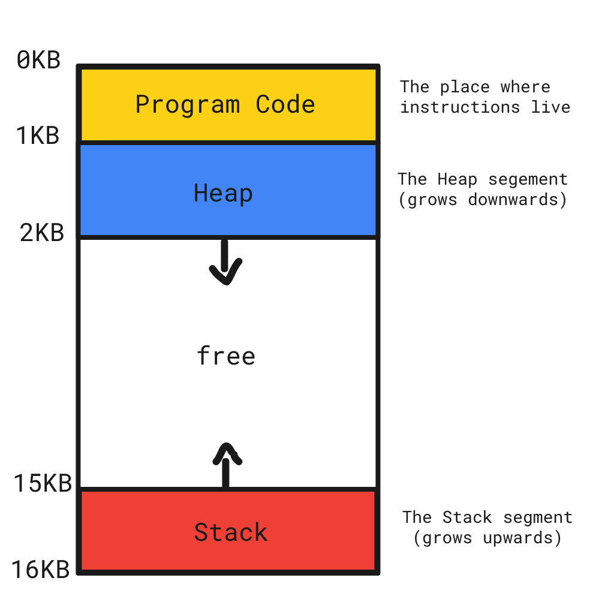
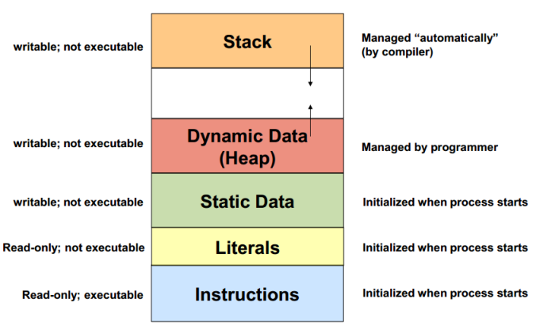

## Part 0 · Bits & Bytes (foundations)

**Core facts**

* A **bit** is 0 or 1.  
* A **byte** is 8 bits and is the **smallest addressable unit** on mainstream CPUs (x86/x86‑64, ARM/ARM64). Each memory address names one **byte**.  
* A **word** is the CPU's natural register size (often 32 or 64 bits). It is **not** the smallest addressable unit.  
* Addresses count bytes; **types** decide how many bytes to read/write starting at that address.  

---

### Units

* 1 **byte** = 8 bits  
* 1 **KiB** = 1024 bytes  
* 1 **MiB** = 1024 KiB  
* Use KiB/MiB/GiB for precision; KB/MB/GB are often used loosely.  

---

### Data types

| Type | Typical size | Key idea |
|---|---:|---|
| **Boolean** | 1 bit (stored in ≥1 byte) | Two values: true/false. |
| **Byte** | 8 bits | Smallest addressable unit. |
| **Integer (signed n-bit)** | 8/16/32/64 | Range ≈ −2^(n−1)…2^(n−1)−1. |
| **Integer (unsigned n-bit)** | 8/16/32/64 | Range 0…2^n−1. |
| **Machine-size int** | 32 or 64 bits | Matches platform word size. |
| **Float32 / Float64** | 32 / 64 bits | IEEE-754; approximate real numbers. |
| **Text (UTF-8 string)** | variable | Unicode in 1–4 bytes per code point. |
| **Pointer / Reference** | 32 or 64 bits | Address/handle to data or object. |
| **Array (fixed)** | N × element size | Contiguous, fixed length. |
| **Dynamic array / Slice** | descriptor + data | Resizable; underlying storage may move. |
| **Struct / Record** | sum of fields (+padding) | Grouped fields; padding for alignment. |

---

## Visual map (conceptual address space)
Let's imagine that we have only 16kb of memory:





> This is a **conceptual** layout; exact addresses change every run due to ASLR (address randomization). The relative roles remain the same.

---

## One-sentence definitions

* **Stack** — Automatic storage for each function call (locals, return addresses); super fast; limited; reclaimed when the function returns.  
* **Heap** — Dynamic storage you request with `malloc` and release with `free`; flexible size; slower; you own the lifetime.  
* **Static / Globals** — Variables that exist for the entire program (either file-scope globals or `static` variables inside functions).  
* **Mapped regions** — Memory areas the OS maps into your process (shared libraries, memory‑mapped files, and sometimes large allocations under the hood).  

---

## Tiny C example

```c
// globals.c (illustrative only)
#include <stdlib.h>

int g = 1;          // global → static storage (whole program lifetime)
static int sg = 2;  // file-scope static → static storage

int main(void) {
    static int sl = 3;      // function-scope static → static storage
    int local = 4;          // stack (lives until function returns)

    int *p = malloc(sizeof *p); // heap (lives until you free it)
    *p = 5;

    const char *s = "hi";  // pointer on stack; the literal lives in a mapped, read-only region

    free(p);
    return 0;
}
```

---

## Rules of thumb

* Prefer **stack** for small, short-lived data. It's automatic and fast.  
* Use the **heap** for big or flexible-sized data that must outlive the current function. Always `free` what you `malloc`.  
* Reserve **static/globals** for truly shared, long‑lived state or constants. Don't overuse them.  
* **Mapped regions** are mostly handled by the OS/runtime (shared libs). When you explicitly `mmap` a file, you treat it like an array in memory.  

---

## Summary

This overview covers the fundamental concepts of memory organization, including:
- Basic storage units (bits, bytes, words)
- Memory addressing and alignment
- Signed/unsigned representations
- The four main memory regions (stack, heap, static/globals, mapped regions)
- Practical guidelines for memory usage
