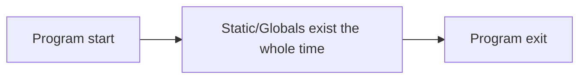

# Static — Short Dive (C)

**What it means**

* **Static storage duration**: the object exists for the **entire program run**.
* **File‑scope `static`**: symbol is **hidden** from other translation units (internal linkage).
* **Function‑scope `static`**: a single instance shared across calls to that function.
* Objects with static storage are **zero‑initialized** by default and must be initialized with a **compile‑time constant**.

---

## Visual: lifetime at a glance



---

## Example 1 — Function‑local static keeps its value

```c
// static_counter.c
#include <stdio.h>

void hit(void) {
    static int count = 0; // initialized once, persists across calls
    ++count;
    printf("hit count = %d
", count);
}

int main(void) {
    hit(); hit(); hit(); // prints 1, then 2, then 3
}
```

**Build & run**

```bash
gcc -O0 -g -Wall -Wextra static_counter.c -o static_counter
./static_counter
```

---

## Rules & restrictions (C)

* Initialization must be a **constant expression** (e.g., numbers, addresses of globals, string literals). This is **invalid** and won’t compile:

  ```c
  static int x = getpid(); // ❌ not a constant expression
  ```
* Function‑local `static` variables are initialized **once**, the first time control passes through their declaration.
* Not automatically thread‑safe if mutated: guard with a mutex or avoid shared mutable statics.
* `static` ≠ `const`. `static` is about **lifetime**/linkage; `const` is about **mutability** through a name.

---

## When to use

* Small, read‑only tables or configuration known at compile time.
* Private module‑level state that truly needs to live for the whole run.
* Avoid for request‑specific or per‑call data; pass state explicitly or use the heap.
